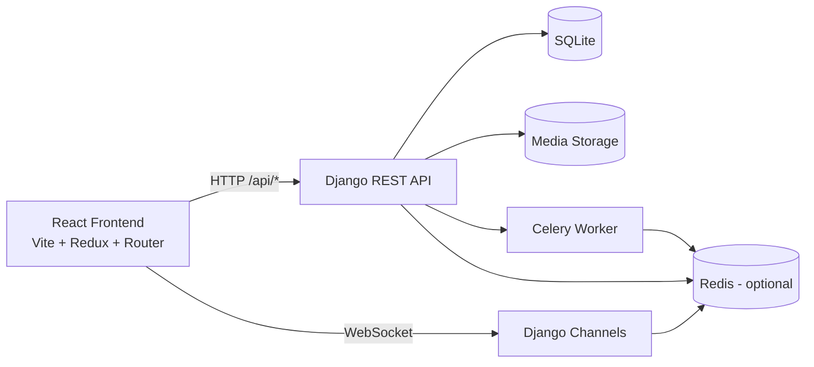
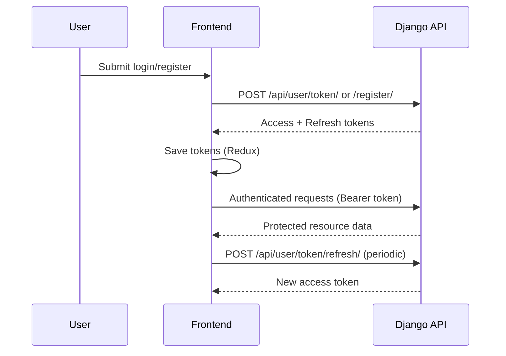

# Service Marketplace

A full-stack service marketplace where users can register, browse businesses, view services, and manage bookings.  
The project uses a React + Vite frontend and a Django REST backend with JWT authentication, optional Redis, and Celery for background work.

## WIP

- Notification
- Update of ReadMe


## Features

- User authentication (register, login, refresh token)
- Forgot password flow (request code, verify code, reset password)
- User profile and profile update
- Business discovery (`all_businesses`)
- CRUD-style resource endpoints for businesses, portfolios, reviews, and services
- Booking endpoints scoped to services
- Protected frontend routes for authenticated pages
- Media upload support on backend

## Tech Stack

### Frontend

- React 19 + Vite
- React Router
- Redux Toolkit + React Redux
- Mantine UI + Tailwind CSS
- MapLibre GL

### Backend

- Django + Django REST Framework
- SimpleJWT (access/refresh tokens)
- Django Channels (WebSocket support)
- Celery + django-celery-beat
- Redis (optional for channels/caching/celery broker)
- SQLite (default local database)

<!-- ## Project Structure

```text
Service_Marketplace/
|-- backend/
|   |-- api/
|   |   |-- business/
|   |   |   |-- models.py
|   |   |   |-- serializers.py
|   |   |   |-- urls.py
|   |   |   `-- views.py
|   |   |-- user/
|   |   |   |-- models.py
|   |   |   |-- serializers.py
|   |   |   |-- urls.py
|   |   |   `-- views.py
|   |   |-- urls.py
|   |   `-- models.py
|   |-- backend/
|   |   |-- settings.py
|   |   |-- urls.py
|   |   |-- asgi.py
|   |   `-- wsgi.py
|   |-- websocket/
|   |-- tasks/
|   |-- executables/
|   |-- media/
|   |-- manage.py
|   |-- requirements.txt
|   |-- Procfile
|   `-- .env.example
|-- frontend/
|   |-- src/
|   |   |-- app/
|   |   |-- components/
|   |   |-- context/
|   |   |-- features/
|   |   |-- pages/
|   |   |-- utils/
|   |   |-- App.jsx
|   |   `-- main.jsx
|   |-- public/
|   |-- package.json
|   |-- vite.config.js
|   `-- .env.example
`-- README.md
``` -->

## Architecture Diagram



## Authentication & Protected Route Flow



<!-- ## API Overview

Base path: `http://127.0.0.1:8000/api/`

### User Endpoints

- `POST /user/register/`
- `POST /user/token/`
- `POST /user/token/refresh/`
- `POST /user/forgot-password/`
- `POST /user/verify-code/`
- `POST /user/reset-password/`
- `POST /user/resend-code/`
- `GET|POST /user/locations/`
- `GET|PUT|DELETE /user/locations/<id>/`
- `GET /user/profile/`
- `PUT|PATCH /user/profile/update`
- `GET|POST /user/services/<service_pk>/bookings/`
- `GET|PUT|PATCH|DELETE /user/services/<service_pk>/bookings/<id>/`

### Business Endpoints

- `GET /all_businesses/`
- `GET|POST /businesses/`
- `GET|PUT|PATCH|DELETE /businesses/<id>/`
- `GET|POST /businesses/<business_pk>/portfolios/`
- `GET|PUT|PATCH|DELETE /businesses/<business_pk>/portfolios/<id>/`
- `GET|POST /businesses/<business_pk>/reviews/`
- `GET|PUT|PATCH|DELETE /businesses/<business_pk>/reviews/<id>/`
- `GET|POST /businesses/<business_pk>/services/`
- `GET|PUT|PATCH|DELETE /businesses/<business_pk>/services/<id>/` -->

## Environment Variables

### Backend (`backend/.env`)

Use `backend/.env.example` as a template:

- `SECRET_KEY`
- `CORS_ALLOWED_ORIGINS`
- `EMAIL_HOST_USER`
- `EMAIL_HOST_PASSWORD`
- Optional: `REDIS_HOST`, `REDIS_PORT`, `ALLOWED_HOSTS`

### Frontend (`frontend/.env`)

Use `frontend/.env.example` as a template:

- `VITE_API_URL` (example: `http://127.0.0.1:8000/api/`)
- `VITE_WS_URL` (example: `ws://127.0.0.1:8000`)

## Local Setup

### 1) Backend

```bash
cd backend
python -m venv env
env\Scripts\activate
pip install -r requirements.txt
python manage.py migrate
python manage.py runserver
```

Optional workers/services (if using Redis/Celery):

```bash
celery -A backend worker --loglevel=info --pool=solo
```

### 2) Frontend

```bash
cd frontend
npm install
npm run dev
```

Frontend default dev URL: `http://localhost:5173`

## Notes

- Backend currently defaults to SQLite for local development.
- If Redis is not configured, the project falls back to in-memory channel layers and eager Celery behavior.
